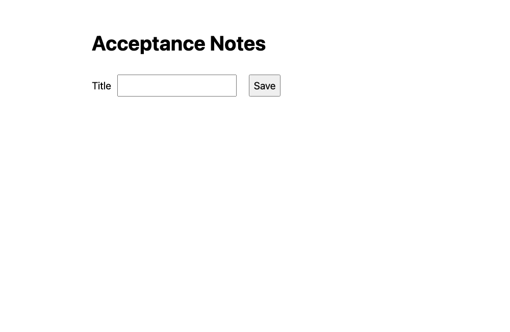
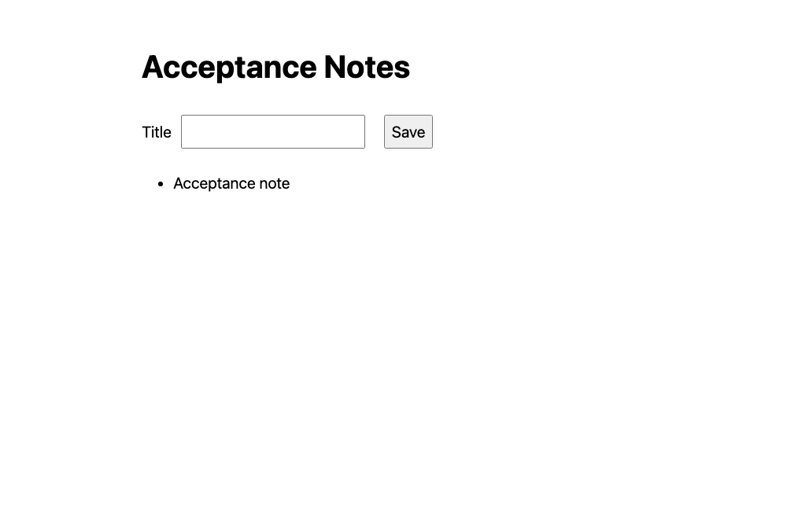
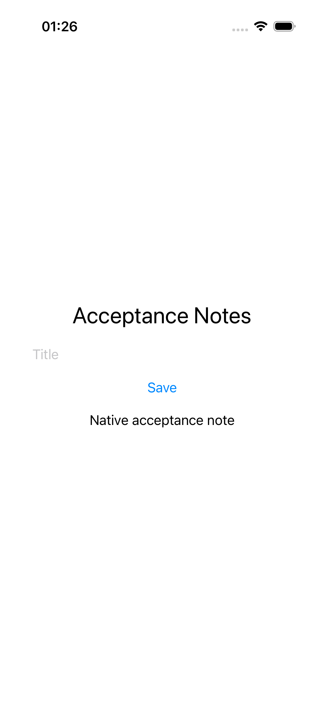

# e2e-testing 技能实现与运行验证报告

## 一、基本信息与结论

| 项目 | 内容 |
| --- | --- |
| 功能 | 新增模型可调用的跨平台功能验收技能，复用已有工具，按平台执行并与 diagnosing-bugs 共用报告 |
| 验收范围 | 技能与仓库集成、API 故障注入、Web 保存后刷新、macOS/iOS 原生保存后重启；Android 环境检查 |
| 代码版本 | 基线 c11109c；本次实现提交 7ed57bd，包含技能、文档、路由、插件清单和 changeset；未包含工作区 .DS_Store 和本地测试报告 |
| 时间 | 2026-10-03，Asia/Shanghai，最终整理于 01:28 后 |
| 总体结论 | 技能已实现；API、Web、macOS 原生和 iOS 模拟器的样例实测通过。Android 阻塞，真机未执行，不能称全部平台兼容性已验证 |
| 证据边界 | 这是维护者按流程执行的样例验证和静态场景审阅，未进行独立模型触发率或自主修复成功率评估。报告完成不代表所有平台验收通过 |

本报告及脱敏附件最初保留在本地，后按用户 2026-10-04 的要求纳入仓库。依赖和 Appium 驱动安装在任务临时目录，未给技能仓库引入跨平台统一运行器或测试依赖。

## 二、平台与设备矩阵

| 目标 | 环境与工具 | 应用/设备 | 结果 |
| --- | --- | --- | --- |
| API | Node 26.8.1、Supertest 7.3.1、node:test | 本地真实 HTTP server、独立 JSON 存储 | 注入错误时 1 失败、1 通过；恢复后 2 通过 |
| Web | Playwright 1.63.0、Chromium 153.0.8010.12 | 桌面浏览器，1000 × 650，真实 HTTP 后端 | 注入未落盘故障时失败；恢复后保存及刷新通过 |
| macOS 原生 | macOS 26.6.2 arm64、Xcode 27.0、Appium 3.8.0、Mac2 4.3.6、WebdriverIO 9.32.0 | 本次构建的 SwiftUI Acceptance Notes，bundle ID local.e2eskill.acceptance.macos | 保存断言通过；修复测试的重启路径后，重启持久化通过 |
| iOS 原生模拟器 | Xcode 27.0、Appium 3.8.0、XCUITest 12.13.3、WebdriverIO 9.32.0 | 专用 iPhone 17 Pro Simulator，iOS 26.5；本次构建的模拟器应用 | 保存、终止、重启和持久化断言通过 |
| Android 原生 | 未发现 ADB、Emulator 和本地 Android SDK | 无可用目标 | 阻塞，未下载完整 SDK，未执行原生流程 |
| iOS/Android 真机与手机浏览器 | 本次无已配置的真机测试目标 | 不适用 | 未执行 |
| Electron、其他桌面浏览器、手机网页模拟 | 技能包含选型与边界说明 | 无本次样例 | 未执行，不借用 Chromium 或 iOS 结果宣称通过 |

Mac2 doctor 提示 Automation Mode 认证为可选事项，但实际会话可运行，本次未改变认证策略或授予系统权限。XCUITest doctor 无必需修复项，缺少 applesimutils 为可选事项；样例没有权限变更需求。没有模拟真机签名验收。

## 三、验收标准对照

| ID | 验收项 | 验证方式 | 结果 |
| --- | --- | --- | --- |
| AC-01 | API 写入结果可通过公开接口读取，非法输入不写入 | 2 个 node:test 用例、Supertest 真 HTTP 请求 | 恢复正确实现后通过 |
| AC-02 | Web 保存后刷新仍能看到内容 | 1 个 Playwright 用例、真实后端，无接口拦截 | 恢复持久化后通过 |
| AC-03 | macOS 原生 UI 保存并重启后读取 | 1 个 WebdriverIO 脚本，辅助功能标识定位与文本断言 | 测试配置修复后的新批次通过 |
| AC-04 | iOS 原生 UI 保存并重启后读取 | 1 个 WebdriverIO 脚本，Simulator 实际安装运行 | 首次通过 |
| AC-05 | Android 原生同类流程 | 环境检查 | 阻塞，不计入通过 |
| AC-06 | 模型可调用、6 份参考文件、索引/插件/文档/路由一致 | frontmatter 校验、链接与 promoted 集合检查 | 通过，插件恰好包含 28 个 promoted 技能 |
| AC-07 | 复用已有框架、只交付一份报告、模拟与真机分开、flaky 不算无条件通过 | 静态场景审阅 | 规则已覆盖，未做独立 agent 行为评测 |
| AC-08 | 插件严格检查与版本一致 | 官方 Claude CLI 2.1.287、仓库版本脚本 | 目录严格校验通过；单独清单严格校验有既有警告，见下文 |

静态审阅场景包括：仅 API 无需 UI；本地原生应用无需 Supertest；Web、Electron、原生 macOS、iOS、Android 分流；已有 XCTest、Espresso、Maestro、Detox、Flutter 测试保持原状；缺工具/权限/签名生成阻塞报告；调用 diagnosing-bugs 复用调用方报告；缺少该技能时使用最小修复流程；单平台、模拟或 flaky 结果不得扩大为全部平台通过。

## 四、执行证据

下列脚本运行在独立样例工作目录，源码、依赖锁文件和日志保存在 [执行附件](assets/evidence/20261003-012813-e2e-testing-skill-测试报告/package.json) 所在目录。私有绝对路径替换为 `<fixture>` 或 `<repository>`。表内计数按批次和用例统计，不累加重跑次数。

| 批次 | 实际命令 | 退出码 | 观察结果 | 证据 |
| --- | --- | --- | --- | --- |
| API-RED | `TEST_BUG=api node --test api.test.mjs` | 1 | 2 用例：1 失败、1 通过；返回 Wrong title 与独立预期不符 | [原始失败](assets/evidence/20261003-012813-e2e-testing-skill-测试报告/api-red.log) |
| API-GREEN | `TEST_BUG='' node --test api.test.mjs` | 0 | 2 用例全部通过 | [复测](assets/evidence/20261003-012813-e2e-testing-skill-测试报告/api-green.log) |
| WEB-RED | `node node_modules/@playwright/test/cli.js test`，服务端 `TEST_BUG=persistence` | 1 | 1 用例失败；POST 返回 201，但刷新后找不到保存内容 | [失败日志](assets/evidence/20261003-012813-e2e-testing-skill-测试报告/web-red.log) |
| WEB-GREEN | 同一 Playwright 命令，服务端关闭故障注入 | 0 | 1 用例通过；真实落盘后刷新可见 | [通过日志](assets/evidence/20261003-012813-e2e-testing-skill-测试报告/web-green.log) |
| IOS-01 | `node native-validation.mjs ios` | 0 | 1 原生流程通过，保存与重启后各有文本断言 | [iOS 日志](assets/evidence/20261003-012813-e2e-testing-skill-测试报告/ios-ui.log) |
| MAC-01 | `node native-validation.mjs macos` | 1 | 保存成功，重启阶段按 bundle ID 找不到临时应用 | [首次失败](assets/evidence/20261003-012813-e2e-testing-skill-测试报告/macos-ui-run1.log) |
| MAC-02 | 同一命令，生命周期调用改用构建路径 | 0 | 1 原生流程通过，包括重启持久化 | [复测](assets/evidence/20261003-012813-e2e-testing-skill-测试报告/macos-ui-run2.log) |
| META-01 | `claude plugin validate . --strict` | 0 | 实际校验 marketplace.json，通过 | [目录检查](assets/evidence/20261003-012813-e2e-testing-skill-测试报告/plugin-validation.log) |
| META-02 | `claude plugin validate .claude-plugin/plugin.json --strict` | 0 | 输出明确显示严格校验失败：根目录 CLAUDE.md 不会被插件加载。该 CLI 仍返回 0，不能只靠退出码判定通过 | [清单检查](assets/evidence/20261003-012813-e2e-testing-skill-测试报告/plugin-manifest-validation.log) |

其他检查：`git diff --check`、`npm run check-plugin-version` 和 skill-creator 的 `quick_validate.py` 均通过。plugin/package 版本保持 1.2.3，本次新增 minor changeset，未直接执行版本发布。原生构建使用 Xcode 的 `swiftc`，分别指定 macOS 和 iOS Simulator SDK；两份应用构建和本地 ad-hoc 签名成功，不能作为真机签名证据。

本次没有未修复的 flaky。macOS 首次失败属于测试配置缺陷，改动后新批次通过，不是无改动重试掩盖失败。

图 1：未落盘故障下，HTTP 保存成功但刷新后的列表为空。

图 2：恢复正确实现后，刷新页面仍显示 Acceptance note。

图 3：iOS Simulator 中的 SwiftUI 原生应用，重启后仍显示 Native acceptance note。

macOS 全屏采集可能包含无关桌面内容，因此不纳入交付附件；以原生自动化断言和日志作为证据。未保留可能包含设备标识和宿主机路径的完整 Appium 原始日志。

## 五、缺陷修复与复测

### INJECT-01：API 返回错误内容

在专用样例中启用 `TEST_BUG=api`，写入时主动替换 title。公开 GET 断言捕获错误。关闭注入恢复正确写入后，同一套 2 个用例通过。此处是可控故障注入与基线恢复，不宣称完成了未知业务缺陷的自主诊断。

### INJECT-02：Web 保存未落盘

启用 `TEST_BUG=persistence` 后，POST 仍返回 201，但没有写入存储。页面刷新断言失败，证明仅检查状态码不足。恢复文件写入后，同一页面测试通过。未删除断言或 mock 内部接口。

### TEST-01：macOS 重启找不到临时构建

保存断言成功，但 `macos: launchApp` 只传 bundle ID，临时路径的应用无法解析。核查已安装 Mac2 的 execute-method-map 后，将终止及启动参数改为 `path`，新批次保存和重启持久化均通过。此为测试配置修复，不是应用缺陷。相关经验已写入技能 macOS 参考文件。

### REPO-01：既有插件严格检查警告

单独验证 plugin.json 时，Claude CLI 提示根目录 CLAUDE.md 不作为插件上下文加载。该文件在任务前已存在，技能清单和 marketplace 检查未发现新增结构问题。本次保留既有上下文文件，未为了清除警告更改仓库上下文策略；严格清单检查仍需后续处理。

已做本次 diff 与规则一致性自查，未开展独立代码审查或多 agent 评审。

## 六、未覆盖项与复查方式

- Android：流程已编写，运行验证因缺 SDK、ADB、Emulator 受阻。配置专用 Emulator 与兼容 APK 后，再执行 UiAutomator2 验收。
- 真机、Electron、WebKit/Firefox、移动网页模拟、权限拒绝、深链与断网恢复未执行。样例无相关业务要求，不能借持久化结果宣称覆盖这些系统行为。
- 原生结果只覆盖一个 SwiftUI 样例、指定版本和当前架构，不证明所有 SwiftUI/AppKit/React Native/Flutter/Tauri 应用均兼容。
- 报告协作和自动触发规则已静态审阅，后续可用独立会话测试触发、缺陷修复和单报告交接。
- 复查 API/Web：在附件样例目录安装依赖后，运行 `node run-web-validation.mjs`。该脚本显式设置故障开关、测试服务地址和截图路径，预期退出码依次为 1、0、1、0。
- 复查原生：用附件 `NativeNotes.swift` 构建相应应用，配置专用设备，在任务本地 Appium home 安装目标驱动，启动端口 4783（iOS）或 4784（macOS）。将专用 Simulator ID 写入仅本地的 `simulator-id`，运行 `node native-validation.mjs ios` 或 `macos`。不得使用个人设备执行数据重置。
- 已核对报告附件相对路径，并解码及目视检查 Web 前后和 iOS 截图；图片清晰。未进行完整 Markdown 渲染快照测试。
- 本次任务的两个 Appium 服务、示例应用和专用模拟器均已停止；未清空设备或删除个人数据。
