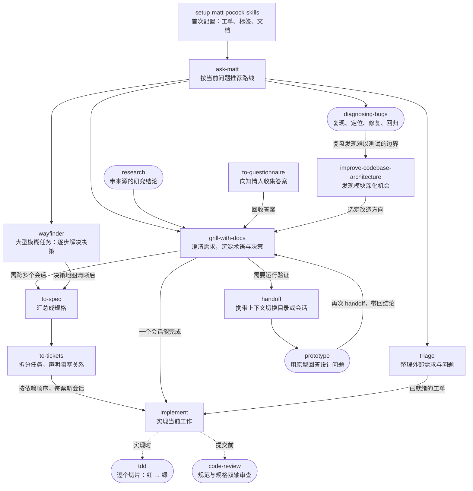
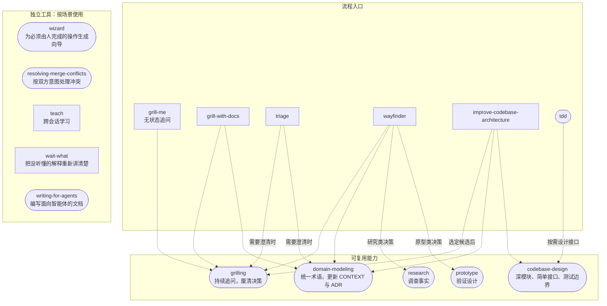
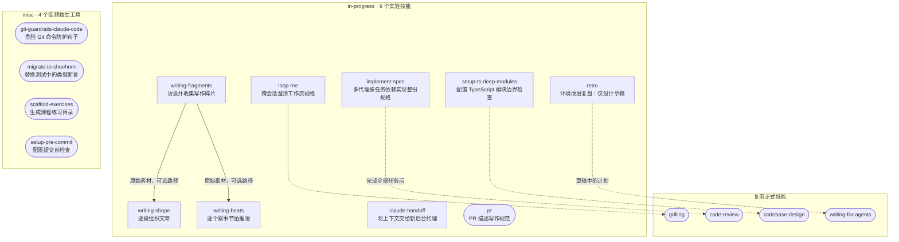

# mattpocock-skills 关系图

基于本地版本 `c55ee46` 的 `SKILL.md`、`ask-matt` 路由说明和 `.agents/invocation.md` 整理。

共 38 个技能：engineering 18 个、productivity 7 个、in-progress 9 个、misc 4 个；deprecated 为空。插件只包含前两个目录的 25 个正式技能。

图例：方框为用户显式调用，圆角胶囊为模型或用户均可调用。实线表示工作流衔接，虚线表示内部调用或按需引用。工作流衔接需要用户选择，不代表一个用户调用型技能能自动调用另一个。

## 1. 从想法到交付

`setup-matt-pocock-skills` 是工程流程的首次配置入口；`ask-matt` 负责推荐路线。图中只画主要路线，路由器也覆盖其他正式技能。

`to-spec` 和 `to-tickets` 产出的内容已经面向实现准备好，无需再经过 `triage`。`wayfinder` 主要产出决策，通常先转规格再实现。原型往返都通过 `handoff` 传递上下文。

## 2. 被复用的能力与独立工具

这些虚线由技能正文中的调用或使用要求支持。`tdd` 仅在接口形状需要设计时引用 `codebase-design`。独立工具没有强制前后顺序。

`grill-me` 与 `grill-with-docs` 复用同一套追问能力；后者额外维护领域模型与决策文档。读取 `CONTEXT.md` 本身不等于调用 `domain-modeling`。

## 3. 实验技能与低频工具

以下 13 个技能不随正式插件分发。写作三件套的实线表示根据输入输出整理的可组合路径，不是声明的自动调用；两种成文方式是可选分支。`retro` 目前仅有设计草稿，尚不可作为完整技能使用。

## 依据

- [主流程与路由说明](skills/engineering/ask-matt/SKILL.md)
- [调用规则](.agents/invocation.md)
- [工程技能](skills/engineering/README.md)
- [效率技能](skills/productivity/README.md)
- [实验技能](skills/in-progress/README.md)
- [低频工具](skills/misc/README.md)
- [TDD 的当前规则](skills/engineering/tdd/SKILL.md)：当前实现循环是红 → 绿，重构属于审查阶段。
